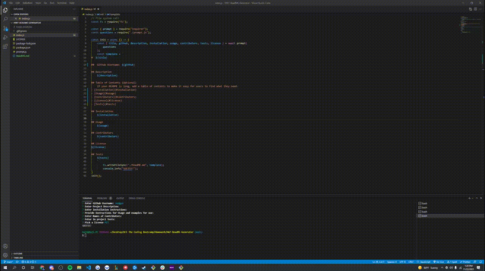

#  HW7-ReadME-Generator

##  nodgyd

## Description
- The purpose of this application was to expand my knowledge on Node.js and its utilization within applications and software. 
- Built this project in order to understand how node operates within the command line and can be utilized to make everyday tasks that much easier.
- This solved a problem in generating a ReadMe.MD when necessary so that I utilize the application whenever I want too! 
- I learned a lot about object deconstruction, node.js properties, calling other js docs, and creating specific documents with the filesystm. 

## Table of Contents (Optional)
    If your README is long, add a table of contents to make it easy for users to find what they need.
- [Installation](#installation)
- [Usage](#usage)
- [Contributors](#contributors)
- [License](#license)
- [Tests](#tests)

## Installation
- User forks/accesses repo
- Installs Node.js (if not already installed in local device)
- npm init -y (to initialize node within the file repository)
- npm i inquirer, to install required node modules for node and the inquirer npm 

## Usage
In order to live test the application a pull/fork is required! 

[

## Contributors
- nodgyd   
    
## License

    
## Tests
N/A
    